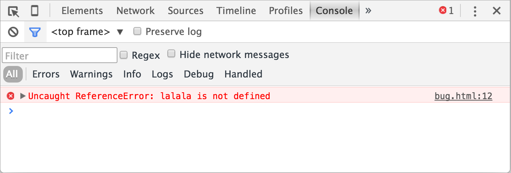

# Consola de desarrollador

El código es propenso a errores. Es probable que cometamos errores... Mejor dicho, **_vamos a cometer errores_**. ¡Siempre los cometemos!

Pero el navegador, de forma predeterminada, no muestra lo errores al usuario. Entonces si algo sale mal en el script, no veremos lo que está "roto" y no podemos solucionarlo.

Para ver los errores y obtener mucha otra información útil sobre los scripts, se han incorporado “herramientas de desarrollo” en los navegadores.

Las herramientas de desarrollo son potentes; Tienen muchas características. Para comenzar, aprenderemos cómo abrirlas, observar errores y ejecutar comandos JavaScript.

## Google Chrome

Abre la página [bug.html](https://es.javascript.info/article/devtools/bug.html)

Hay un error en el código JavaScript dentro de la página. Está oculto a los ojos de un visitante regular, así que abramos las herramientas de desarrollador para verlo.

Presione `F12` o, si está en Mac, entonces combine `Cmd+Opt+J`.

Las herramientas de desarrollador se abrirán en la pestaña Consola de forma predeterminada.

Se ve algo así:

- Aquí podemos ver el mensaje de error de color rojo. En este caso, el script contiene un comando desconocido “lalala”.
- A la derecha, hay un enlace en el que se puede hacer clic en la fuente `bug.html:12` con el número de línea donde se produjo el error.

Debajo del mensaje de error, hay un símbolo azul `>`. Marca una “línea de comando” donde podemos escribir comandos JavaScript. Presione `Enter` para ejecutarlos.

## Firefox, Edge y otros

La mayoría de los otros navegadores usan `F12` para abrir herramientas de desarrollador.

La apariencia de ellos es bastante similar. Una vez que sepa cómo usar una de estas herramientas (puede comenzar con Chrome), puede cambiar fácilmente a otra.

## Safari

Safari (navegador Mac, no compatible con Windows/Linux) es un poco especial aquí. Necesitamos habilitar primero el “Menú de desarrollo”.

Abra Preferencias y vaya al panel “Avanzado”. Hay una casilla de verificación en la parte inferior:

Ahora combine `Cmd+Opt+C` para alternar a consola. Además, tenga en cuenta que ha aparecido el nuevo elemento del menú superior denominado “Desarrollar”. Tiene muchos comandos y opciones.
